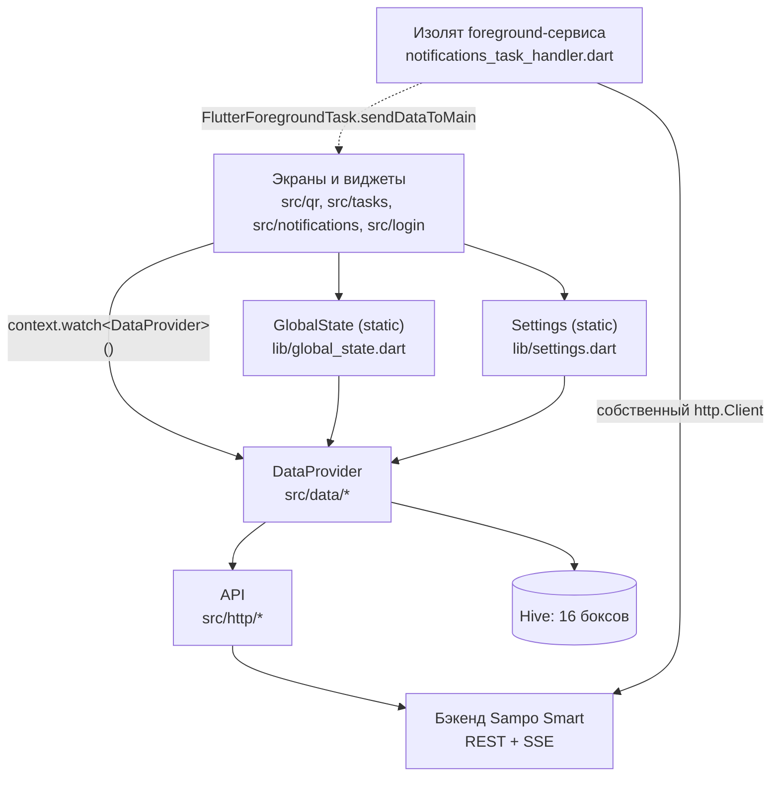

# Архитектура

## Стиль

**Layer-first внутри одного пакета, без слоя домена.** Никакой Clean Architecture,
никаких use-case, никаких репозиториев на фичу. Одна библиотека `qr_scan_industry`,
код в `lib/src/`, папки — частично по слою (`http/`, `data/`, `model/`, `design/`,
`widgets/`, `utils/`), частично по фиче (`qr/`, `tasks/`, `notifications/`,
`onboarding/`, `login/`, `splash/`, `knowledge_base/`).

**Заявленное направление ≠ текущее состояние.** `REFACTORING_CHECKLIST.md`, Phase 8
описывает целевую feature-first структуру (`features/{auth,home,scan,tasks,...}` +
`core/{http,storage,state,routing,utils}`) — она **не сделана** и в чек-листе стоит
без отметки. Не начинай переезд папок мимоходом; пиши новый код в текущей структуре.

## Дерево `lib/`

```
lib/
├── main.dart                    точка входа, GoRouter, MyApp, отладочная полоса
├── global_state.dart            статический «god object»: dataProvider, authUser, debug
├── settings.dart                пользовательские настройки поверх Hive stringBox
├── strings.dart                 класс Strings, единственная локаль 'ru'
└── src/
    ├── app_bar/app_bar.dart     MyAppBar.build(context) — один AppBar на все экраны
    ├── app_lifecycle/           AppLifecycleObserver (resume → ensureRunning push)
    ├── data/
    │   ├── data_provider.dart       ядро: боксы + in-memory кэш + геттеры
    │   ├── data_provider_remote.dart  part: загрузка с сервера + login
    │   ├── data_provider_sync.dart    part: sync* + mainSync + вечные циклы
    │   ├── data_provider_outbox.dart  part: очереди отправки + ретраи
    │   ├── hive_storage_location.dart каталог базы + перенос со старой схемы
    │   └── repair_photo_files.dart    снимки ремонта на диске (не в Hive)
    ├── design/
    │   ├── app_constants.dart       токены: spacing/radius/elevation/duration/fontSize
    │   ├── app_theme.dart           2 ColorScheme + все sub-темы + AppSemanticColors
    │   ├── theme_extensions.dart    МЁРТВЫЙ: 0 импортов
    │   └── README.md                боилерплейт генератора, не документация
    ├── exceptions/app_exceptions.dart  3 исключения (только для логина)
    ├── http/
    │   ├── api.dart                 ядро: baseUrl, jwtToken, таймауты, isAlive
    │   ├── auth_api.dart            part: me / login / getCompany / getCurrentSession
    │   ├── equipment_api.dart       part: оборудование, состояния, наработка
    │   ├── task_api.dart            part: задачи, типовые проблемы, периодичность
    │   ├── scan_api.dart            part: sendScan (multipart)
    │   ├── notifications_api.dart   part: список/настройки/read/SSE-стрим
    │   ├── repair_api.dart          part: ремонты, нормы расхода, фото, захват
    │   └── spare_part_api.dart      part: справочник ЗИП + история движения
    ├── knowledge_base/          InAppWebView + url_launcher
    ├── login/login_screen.dart
    ├── model/                   26 файлов, 28 рукописных Hive TypeAdapter
    ├── notifications/
    │   ├── notifications_service.dart   синглтон: список, unread, SSE в main isolate
    │   ├── notifications_screen.dart    экран центра уведомлений
    │   ├── notification_card.dart       карточка + пилюли (статус/приоритет/дедлайн)
    │   ├── notification_formatters.dart чистые форматтеры
    │   ├── notifications_settings_screen.dart
    │   ├── sse_line_parser.dart         общий парсер SSE для обоих изолятов
    │   └── push/
    │       ├── push_notifications_controller.dart  управление foreground-сервисом
    │       ├── notifications_task_handler.dart     ВТОРОЙ ИЗОЛЯТ: SSE + локальные пуши
    │       └── notification_router.dart            роутинг тапа по пушу
    ├── onboarding/              welcome / видеоплеер / демо-модалка / демо-оборудование
    ├── qr/
    │   ├── qa_actions.dart          главный hub-экран (/actions)
    │   ├── qr_screen.dart           сканер
    │   ├── qr_result_screen.dart    экран результата скана (ядро продукта)
    │   ├── result_controls.dart     контролы формы осмотра
    │   ├── scanner_button_widgets.dart / scanner_error_widget.dart
    │   └── scanned_barcode_label.dart   МЁРТВЫЙ: 0 ссылок
    ├── repairs/                 список ремонтов, карточка (2.5k строк), создание,
    │                            разрешение конфликта, пикер ЗИП, пилюли, тексты ошибок
    ├── spare_parts/             справочник ЗИП + карточка позиции с историей движения
    ├── splash/splash_screen.dart
    ├── style/                   snack_bar.dart (единственный файл)
    ├── tasks/                   список оборудования, карточка задач, фильтр, барреллы
    ├── update_manager.dart      ОТКЛЮЧЁН явным флагом `enabled = false`
    ├── utils/                   AnyController, Dialogs, go_router_ext, Dependent, …
    └── widgets/                 переиспользуемые виджеты
```

## Ответственность слоёв (как есть)

| Слой | Что делает | Чего **не** делает |
|---|---|---|
| Экран (`*_screen.dart`, `qa_actions.dart`) | Вся UI-логика, валидация формы, показ диалогов/снекбаров, навигация. Читает данные напрямую через `GlobalState.dataProvider` | Не изолирован от Hive и API — обращается к ним напрямую |
| `DataProvider` (`src/data/`) | Владеет всеми Hive-боксами + in-memory списками. Загрузка справочников, синхронизация, офлайн-очереди, login | Не знает про UI. Ошибки **глотает** (`print` + `finally`), кроме `updateEquipmentState` и `login` |
| `API` (`src/http/`) | HTTP: заголовки, таймауты, декодирование UTF-8, разбор JSON в модели, multipart | Не кэширует, не ретраит, не знает про Hive |
| `model/` | Данные + `fromJson` + (иногда) `toJson` + рукописный `TypeAdapter` | Нет бизнес-логики, кроме мелких геттеров (`descriptionText`, `isActive()`, `validate()`) |
| `design/` | Токены и тема | Не содержит виджетов |
| `widgets/` | Мелкие переиспользуемые виджеты | Не ходят в сеть; читают `GlobalState.dataProvider` (`select_state_button.dart:47`) |

## Направление зависимостей



Цикл `GlobalState ↔ DataProvider` существует и он намеренный: `DataProvider`
вызывает `GlobalState.dataProvider` изнутри себя
(`lib/src/data/data_provider_outbox.dart:10-25`), хотя `this` доступен. Это
легаси — новый код в `DataProvider` должен использовать поля инстанса, а не
`GlobalState.dataProvider`.

## Управление состоянием

Четыре сосуществующих механизма. Доминирующий — первый.

1. **`ValueNotifier` + `ValueListenableBuilder`** — основной способ реактивности.
   - `NotificationsService.instance.unreadCount`, `.notifications`, `.isLoading`,
     `.isLoadingMore`, `.hasMore`, `.hasLoadedOnce`
     (`lib/src/notifications/notifications_service.dart:22-35`);
   - `AppTheme.activeThemeId` (`lib/src/design/app_theme.dart:37`) — слушается
     в `main.dart:410` и перестраивает весь `MaterialApp`;
   - `GlobalState.debug` (`lib/global_state.dart:58`) — отладочная полоса;
   - `DataProvider.activeRepairsCount` (`data_provider.dart:153`) — счётчик на
     плитке «Ремонты»: активные ремонты плюс неотправленные черновики.
     Заведён именно `ValueNotifier`, потому что сам `DataProvider` не
     реактивный; пересчитывается методом `_refreshActiveRepairsCount()` из
     каждого места, где меняется список или очередь;
   - `DataProvider.authExpired` (`data_provider.dart:161`) — токен протух,
     очередь встала. Список ремонтов показывает по нему баннер;
   - `AnyController<T>` (`lib/src/utils/any_controller.dart`) — обобщённый контейнер
     значения для форм: `AnyController<Priority>`, `AnyController<String>`,
     `AnyController<List<UsageUpdate>>`.

2. **`setState` внутри `State`** — вся локальная логика экранов и форм. Виджеты
   подписываются на `controller.valueNotifier` через `ControllerListenerMixin`
   (`lib/src/widgets/controller_listener_mixin.dart`).

3. **`provider`** — используется **минимально**: в `MultiProvider` объявлен
   ровно один `Provider` — `DataProvider`. Читается через
   `context.watch<DataProvider>()` (`login_screen.dart:41`, `qr_screen.dart:84`,
   `qr_result_screen.dart:274`). Плюс
   `InheritedProvider<ValueNotifier<AppLifecycleState>>` в
   `app_lifecycle.dart:39` и `ValueListenableProvider` внутри `Dependent`.

4. **Глобальные статики** — `GlobalState.dataProvider`, `GlobalState.authUser`,
   `Settings.*`, `DataProvider.closedTasks`, `API.currentSession`,
   `API.simulateOffline`. Читаются откуда угодно.

**Известное противоречие (не разрешено).** `DataProvider` доступен и как
`Provider`, и как статик `GlobalState.dataProvider`. В одном и том же файле
встречаются оба: `qr_result_screen.dart:274` берёт из `Provider`, а
`qr_result_screen.dart:107` — из статика. `REFACTORING_CHECKLIST.md`, Phase 6
помечает это как открытый пункт. **Рекомендация для нового кода:** в `build()`
экрана бери через `context.watch<DataProvider>()`, в колбэках и вне контекста —
через `GlobalState.dataProvider`. Так делает большинство существующих экранов.

Чего в проекте **нет**: BLoC/Cubit, Riverpod, GetX, MobX, `ChangeNotifier` как
модель состояния, `freezed`, кодогенерация любого рода в `lib/`.

## Внедрение зависимостей

**DI-контейнера нет.** Способы получения зависимостей, по убыванию частоты:

1. Статическое поле, проставленное в `main()`:
   `GlobalState.dataProvider = dataProvider` (`main.dart:160`),
   `Settings.dataProvider = dataProvider` (`main.dart:161`).
2. Синглтон через приватный конструктор:
   ```dart
   class NotificationsService {
     NotificationsService._();
     static final NotificationsService instance = NotificationsService._();
   ```
   (`notifications_service.dart:16-18`; так же `PushNotificationsController`,
   `PushNotificationRouter`).
3. `Provider` в дереве виджетов — только `DataProvider`.
4. Конструктор — для контроллеров форм, которые экран создаёт и передаёт вниз
   (`qr_result_screen.dart:39-47` → `ResultControls`).

`API` инстанцируется на месте: `API()` (`main.dart:135`,
`notifications_service.dart:37`) — класс stateless, всё состояние в статиках.

## Навигация

`go_router` **7.1.1** (устаревшая мажорная версия; API `GoRouter.of(context).location`
удалён в 8.x — при апгрейде сломается `app_bar.dart:41` и `qr_result_screen.dart:339`).

- **Один роутер, объявлен статически** в `MyApp._router` (`lib/main.dart:234-496`).
  Плоский список из 21 `GoRoute`, вложенных маршрутов и `ShellRoute` нет.
- **`navigatorKey: PushNotificationRouter.navigatorKey`** — чтобы фоновый изолят мог
  навигировать.
- **`routerNeglect: true`** — не писать историю в браузере.
- **Единственный гвард — `redirect`** (`main.dart:197-226`):
  ```
  не авторизован + защищённый маршрут  → /login
  авторизован + /login + онбординг не пройден → /onboarding
  авторизован + /login                  → /actions
  авторизован + отложенный тап по пушу  → /notifications (единожды)
  ```
  Публичные маршруты: всё, что начинается с `/login`, и ровно `/knowledge_base`.
- **Переходы делятся на два вида** — оба живут в `lib/src/utils/go_router_ext.dart`:

  | Вид | Чем | Где |
  |---|---|---|
  | **Вглубь** — хаб → раздел → карточка | `push` | плитки хаба, сканер → карточка результата, списки → карточки, карточка оборудования → форма создания ремонта |
  | **Сброс** — после него возвращаться некуда | `clearStackAndNavigate` (`pop()` до дна + `pushReplacement`) | вход, выход, splash, шаги онбординга |
  | **Замена текущего экрана** | `pushReplacement` | форма создания ремонта → карточка созданного ремонта или список |
  | **Назад** | `backOr(fallback)` — `pop()`, а если стек пуст, то сброс на запасной адрес | все кнопки «назад», включая `MyAppBar` |

  Запасной адрес у `backOr` обязателен: на экран можно попасть тапом по
  пуш-уведомлению или сразу после сброса, и тогда возвращаться некуда.

  `GoRouter.of(ctx).go` остался в `notification_router.dart` (намеренно, с
  комментарием: безопаснее во время ребилда) и на пути «токен протух → логин».
- **Анимации перехода нет.** Все 21 маршрут объявлены через `pageBuilder`,
  возвращающий `NoTransitionPage`. `builder` не используется нигде: он дал бы
  штатный Material-переход, а его тоже не должно быть. Прежняя фирменная
  анимация-шторка (`my_transition.dart`) и `Palette`, существовавший только
  ради её цвета, удалены.
- **Передача данных:** через `state.extra` типизированным объектом
  (`main.dart:343,357,368` → `InventoryRecord`) и через `state.pathParameters`
  (`/details/:index` — целочисленный `id`, **не** uuid). `REFACTORING_CHECKLIST.md`
  помечает `state.extra` как подлежащее замене — но замена не сделана.

### Таблица маршрутов

Все маршруты объявлены одинаково: `pageBuilder` → `NoTransitionPage`.

| Путь | Экран | Примечание |
|---|---|---|
| `/` | `SplashScreen` | сразу редиректит на `/login` |
| `/login` | `LoginScreen` | публичный; единственный не-`const` `NoTransitionPage` — у `LoginScreen` неконстантный конструктор |
| `/onboarding` | `OnboardingWelcomeScreen` | |
| `/onboarding_video` | `OnboardingVideoPlayer` | видео выбирается по `Settings.onboardingStep` |
| `/actions` | `QRActions` | главный hub |
| `/tasks` | `EquipmentListScreen()` | список оборудования с задачами |
| `/problems` | `EquipmentListScreen(isProblems: true)` | вход без QR |
| `/knowledge_base` | `KnowledgeBaseScreen` | публичный |
| `/details/:index` | `EquipmentDetailScreen` | `index` = `InventoryRecord.id` |
| `/qr_scanner` | `QRScreen` | |
| `/notifications` | `NotificationsScreen` | |
| `/notifications_settings` | `NotificationsSettingsScreen` | |
| `/qr_result` | `QRResultScreen` | `extra: InventoryRecord` |
| `/qr_result_demo` | `QRResultScreen` | демо-режим онбординга |
| `/qr_result_problems` | `QRResultScreen` | тот же экран, другой запасной путь «назад» |
| `/repairs` | `RepairsListScreen` | список ремонтов обходчика |
| `/repair_create` | `CreateRepairScreen` | `extra: InventoryRecord`, вход только из карточки скана |
| `/repairs/:uuid` | `RepairDetailScreen` | `extra: Repair` (необязателен) |
| `/repair_draft/:localId` | `RepairDetailScreen` | тот же экран в режиме локального черновика |
| `/spare_parts` | `SparePartsScreen` | справочник ЗИП |
| `/spare_parts/:uuid` | `SparePartDetailScreen` | карточка позиции ЗИП |

`MyAppBar.build(context)` ветвится **по строке `location`** (`app_bar.dart:43-160`) —
то есть добавление маршрута требует правки `app_bar.dart`, иначе экран получит
дефолтный тёмный AppBar с одной кнопкой «Выйти».

**Исключение из этого правила** — экраны, у которых заголовок зависит от
данных: карточка ремонта (номер + пилюля статуса) и карточка ЗИП (значок,
название, пилюля наличия) строят собственный `AppBar`, и веток для
`/repairs/<uuid>` и `/spare_parts/<uuid>` в `app_bar.dart` намеренно нет —
там оставлены поясняющие комментарии. Повторяй этот приём, когда заголовок
нельзя вывести из одной строки маршрута.

## Поток данных

**Чтение (справочники).**
```
вечный цикл 60 с (startSyncing) ─┐
кнопка «Синхронизировать данные» ─┤→ mainSync()
логин, вход на /actions, /tasks  ─┘
       │
       ├─ syncInventory()      → api.getEquipment() постранично → inventoryBox.clear() + addAll
       ├─ syncTasks()          → api.getCurrentTasks() + getCurrentOpenTasks() → taskBox
       ├─ syncTypicalProblems()→ typicalProblemBox
       ├─ syncPeriodicityRules()
       ├─ syncUsageUnitTypes()
       ├─ syncEquipmentStates()
       ├─ syncSpareParts()     → справочник ЗИП (нужен офлайн для расхода)
       ├─ syncMyRepairs()      → активные ремонты пользователя → repairBox
       ├─ saveLastSyncDate()
       └─ syncCompany()
```
Исключение из «полной перезаписи»: **закрытые ремонты не кэшируются вовсе.**
Их отдаёт отдельный эндпоинт (последние 10, без пагинации), и живут они только
в памяти экрана списка — уход с экрана их забывает.
Все `sync*` реализованы одинаково: `_isLoading = true` → `try { загрузить; box.clear();
box.addAll() } catch (e) { print } finally { _isLoading = false }`. Ошибка **не
пробрасывается** — экран о ней не узнаёт. UI читает **из Hive**, а не из результата
запроса.

**Запись (осмотры, наработка, ad-hoc задачи).**
```
экран → dataProvider.addScan/addUsageScan/addPeriodicTask → scanBox / scanUsageBox / periodicTaskBox
                                                                 │
вечный цикл 5 с (startScanSyncing) ──────────────────────────────┤
                                                                 ▼
                             syncScans() / syncUsageScans() / syncPeriodicTasks()
                                                                 │
                     переложить в *PendingBox + записать timestamp в stringBox
                                                                 │
                                          api.sendScan(...) ──► успех: удалить из pending
                                                           └──► неуспех: остаётся в pending,
                                                                вернётся в основной бокс
                                                                через 120 секунд
```
Ключ элемента очереди — `key()`, md5 от JSON-содержимого (`scan.dart:19-30`), то есть
**дедупликация по содержимому**: два идентичных осмотра схлопнутся в один.

Особые правила очереди:
- `_isSyncingScans` защищает от параллельного запуска ручной и автоматической
  синхронизации; у ремонтов ту же роль играют `_isSyncingPendingRepairs` и
  `_isSyncingRepairUpdates`;
- задача ТО (`maintenance_task_<uuid>` в `stringBox`) **не отправляется**, пока по
  тому же оборудованию висит неотправленная наработка;
- при старте приложения всё из `pending_scans` возвращается в `scans`
  (`main.dart:174-177`).

**Вторая очередь — ремонты**, устроена иначе (`syncPendingRepairs`,
`syncPendingRepairUpdates` в `data_provider_outbox.dart`). Отличия, которые
нельзя «причесать» под схему осмотров:

```
pendingRepairBox ──► createRepair(Idempotency-Key = draft.localId)
                          │  serverUuid пишется в бокс СРАЗУ, до фото
                          ▼
                     фото по одному, у каждого свой Idempotency-Key
                     (ключ = md5 содержимого кадра); принятый путь
                     тут же вычёркивается и файл удаляется
                          ▼
                     updateRepair(расход + комментарий [+ статус])
                          ▼
                     upsertRepair() в repairBox + удалить черновик
```

- **пары `pending_` нет** — от дубля защищает `Idempotency-Key` на сервере,
  а не таймаут возврата;
- **отказ ≠ отсутствие связи**: `isRetryableRepairError` разделяет их. Нет
  связи — попытка даже не засчитывается; сервер отказал — причина пишется
  в черновик по-русски, и автоповторов больше нет, решает обходчик;
- конфликт «оборудование уже в ремонте» дополнительно доискивает занявший
  ремонт (`_findBlockingRepair`) и кладёт его uuid в черновик — это данные
  для экрана разрешения конфликта;
- `AuthExpiredException` не считается отказом черновика: поднимается флаг
  `authExpired`, отправка продолжится после повторного входа;
- снимки лежат **файлами на диске** (`repair_photo_files.dart`), а не base64
  в Hive: черновик может ждать связи сутками, и держать кадры в базе дорого.

## Поток ошибок

Единой модели ошибок нет. Что есть:

| Уровень | Поведение | Файл |
|---|---|---|
| `API` | `throw Exception('Failed to …: ${response.statusCode}')` на не-2xx. Логин дополнительно маппит сетевые сбои в `NoConnectionException`, 401/403 → `InvalidCredentialsException` | `src/http/*.dart`, `auth_api.dart:98-121` |
| `DataProvider.sync*` | `catch (e) { print(...) }` — ошибка глотается | `data_provider_sync.dart` |
| `DataProvider.login` | Различает `InvalidCredentialsException` (rethrow) и всё сетевое (фолбэк на локальных пользователей) | `data_provider_remote.dart:96-164` |
| `DataProvider.updateEquipmentState` | Пробрасывает — UI ловит и показывает снекбар | `data_provider.dart:160-170` |
| Экран | `try/catch` + `Dialogs.notify(...)` или `ScaffoldMessenger.showSnackBar` | `login_screen.dart:73-95`, `qr_result_screen.dart:106-117` |

Кастомные исключения — только три, все про логин
(`lib/src/exceptions/app_exceptions.dart`): `WalkerOnlyException`,
`NoConnectionException`, `InvalidCredentialsException`. Никаких `Result<T, E>`,
`Either`, sealed-классов.

**Детект офлайна повторяется строками.** Проверка «это сетевая ошибка?» реализована
через `e.toString().contains('SocketException' | 'Failed host lookup' |
'Connection refused' | 'Network is unreachable' | 'TimeoutException')` минимум
в трёх местах: `auth_api.dart:107-112`, `data_provider_remote.dart:120-125`,
`qr_result_screen.dart:80-88`. Если пишешь новую такую проверку — переиспользуй
форму из `qr_result_screen._isOfflineError`, не изобретай четвёртую.

## Конфигурация и окружение

- **Один источник — `.env` в корне проекта.** Флейворов (`--flavor`) нет,
  `--dart-define` не используется, `String.fromEnvironment` встречается только
  в закомментированном блоке `main.dart:87-88`.
- `.env` **не отслеживается git** (в рабочей копии числится как untracked), но при
  этом **и не внесён в `.gitignore`** — то есть закоммитить его можно случайно.
  Одновременно он объявлен ассетом (`pubspec.yaml:66`), то есть попадает внутрь APK.
  Не добавляй в него ничего секретного и не коммить.
- Читается двумя независимыми путями: `flutter_dotenv` в Dart и
  `java.util.Properties` в Gradle. Формат должен быть валиден для обоих —
  **без кавычек вокруг значений**.
- `local.properties` (Android SDK/Flutter SDK пути) — машинно-зависимый, в репозитории есть.

## Границы генерируемого кода

В `lib/` кодогенерации **нет**. `hive_ce_generator` числится в `dev_dependencies`,
но `build_runner` не подключён и `*.g.dart`/`*.freezed.dart` в проекте отсутствуют —
все `TypeAdapter` написаны руками (`REFACTORING_CHECKLIST.md`, Phase 7:
«Решение: оставляем ручной `read`/`write` (без кодогена)»).

Не редактировать и не считать образцом стиля:
- `android/app/src/main/java/io/flutter/plugins/GeneratedPluginRegistrant.java`
- `ios/Runner/GeneratedPluginRegistrant.{h,m}`
- `ios/Flutter/Generated.xcconfig`, `ios/Flutter/flutter_export_environment.sh`
- `.dart_tool/`, `build/`, `android/app/.cxx/`, `android/.kotlin/`
- `.flutter-plugins`, `.flutter-plugins-dependencies`
- `pubspec.lock` (менять только через `flutter pub`)

## Доминирующие паттерны — образцы для подражания

| Что делаешь | Смотри на |
|---|---|
| Новый HTTP-метод | `lib/src/http/equipment_api.dart` — extension на `API`, `_guardOffline()`, проверка `jwtToken`, `Utf8Decoder(allowMalformed: true)`, `.timeout(API._readTimeout)` |
| Новый справочник в синхронизацию | `DataProviderSync.syncUsageUnitTypes` (`data_provider_sync.dart:64-76`) + добавить вызов в `mainSync()` |
| Новая офлайн-очередь без побочных эффектов | `DataProviderOutbox.syncPeriodicTasks` — пара боксов + возврат из pending через 120 с |
| Новая офлайн-очередь с побочным эффектом на сервере | `DataProviderOutbox.syncPendingRepairs` (`data_provider_outbox.dart:25-113`) — `Idempotency-Key`, пошаговая фиксация прогресса, разделение «нет связи / отказ» |
| Экран с офлайн-состоянием и очередью | `lib/src/repairs/repairs_list_screen.dart` + `lib/src/widgets/offline_banner.dart` |
| Перевод ошибки сервера в текст для пользователя | `lib/src/repairs/repair_error_messages.dart` (`repairErrorMessage`, `isRetryableRepairError`) |
| Новая модель с Hive | `lib/src/model/usage_update.dart` — минимальная и корректная: поля, `key()`, `toJson()`, адаптер с симметричными `read`/`write` |
| Новый экран-список | `lib/src/tasks/equipment_list_screen.dart` (`EmptyState` + `ListView.separated` + карточка-подвиджет) |
| Новый экран-форма | `lib/src/qr/qr_result_screen.dart` + `result_controls.dart` (контроллеры в `State`, sticky bottom bar) |
| Новый сервис с реактивным состоянием | `lib/src/notifications/notifications_service.dart` |
| Новый диалог подтверждения | `Dialogs.areYouSure` (`lib/src/utils/dialogs.dart:48`) |
| Новый нижний лист | `showAppModalSheet` (`lib/src/widgets/app_bottom_sheet.dart`) |

## Легаси и исключения — не тиражировать

| Что | Где | Статус |
|---|---|---|
| `theme_extensions.dart` | `lib/src/design/` | **0 импортов.** `context.gapMD`, `context.paddingLG`, `context.colorScheme` в проекте не используются |
| `select_priority_button.dart`, `select_problem_button.dart`, `select_state_button.dart`, `select_usage_button.dart`, `button_with_select_dialog.dart` | `lib/src/widgets/` | **0 внешних ссылок.** Заменены встроенными пикерами в `result_controls.dart` и `_HeroPassport` |
| `scanned_barcode_label.dart`, `dependent_multi.dart`, `self_cancel_timer.dart` | `lib/src/qr/`, `lib/src/utils/` | **0 ссылок** |
| `UpdateManager` | `lib/src/update_manager.dart` | Отключён флагом `static const bool enabled = false`; `checkForUpdate` выходит первой строкой. Вызовы из 4 экранов ничего не делают. Отключён намеренно (вероятно, в пользу Shorebird). Раньше это было сделано `return;`-ом и давало `dead_code`-warning — теперь `flutter analyze` чист, кроме `include_file_not_found` |
| `getInventoryRecords()` | `equipment_api.dart:28` | Не вызывается; заменён на `getEquipment()` (см. закомментированную строку `data_provider_remote.dart:11`) |
| `flutter_screenutil` | `main.dart:394`, `login_screen.dart:116` | `ScreenUtilInit` обёрнут вокруг всего приложения, но `.sw/.sp/.w/.h` использованы **один раз**. Не начинай использовать |
| `Dependent<T>` | `lib/src/utils/dependent.dart` | Один потребитель (`main.dart:445`). Для нового кода бери штатный `ValueListenableBuilder` |
| `GlobalState.dataProvider` внутри `DataProvider` | `data_provider_outbox.dart:10-25` | Обращение к самому себе через глобальный статик. В новом коде — поля инстанса |
| `GlobalState.hasConnectionToServer2` | `global_state.dart:198` | Дубль без кэша, не используется |
